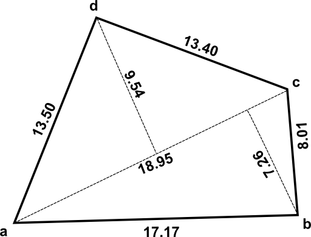
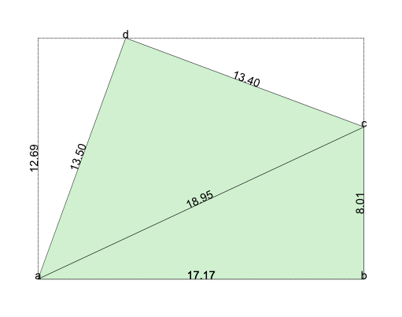

# IllegalShapedLand

相続税の計算における不整形地から想定整形地を求めます

## 概要

土地を相続する場合、土地の評価額を算出する必要があります。
周辺の道路の路線価が決まっている場合はそれを元に計算します。

国税庁のホームページ
 [土地家屋の評価](https://www.nta.go.jp/taxanswer/sozoku/4602.htm)にその計算方法が掲載されています。

ただし、角地の場合は側方の路線価を考慮する必要があります。
（[地区の異なる2以上の路線に接する宅地の評価](https://www.nta.go.jp/taxanswer/hyoka/4605.htm)）

また、土地の形状が長方形でない場合は[不整形地の評価](https://www.nta.go.jp/shiraberu/zeiho-kaishaku/tsutatsu/kihon/sisan/hyoka/02/03.htm)
を考慮する必要があります。


## 相続税における土地の評価

## 不整形地から想定整形地を求める

以下のような土地の図面があったとします。



各頂点に名前を付けて、それぞれの辺の長さを定義します。

```java
        List<Edge> edges = Arrays.asList(
            new Edge("a", "b", 17.17),
            new Edge("b", "c",  8.01),
            new Edge("c", "d", 13.40),
            new Edge("d", "a", 13.50),
            new Edge("a", "c", 18.95)
        );
```

土地を構成する三角形を定義します。
頂点の名前を右回りに定義する必要があります。

```java
        List<Triangle> triangles = Arrays.asList(
            new Triangle("a", "d", "c"),
            new Triangle("a", "c", "b")
        );
```

基準とする２点（この場合はaとb）を指定してLandオブジェクトを作成します。

```java
        Land land = new Land("a", "b", edges, triangles);
        System.out.printf("面積=%f㎡%n", land.area);
        System.out.printf("想定整形地 %fm×%fm=%f㎡%n", land.width, land.height, land.legalShapedArea);
        land.writeSVG(new File("data/sample.svg"));
```

結果は以下のように表示されます。

```
面積=159.213309㎡
想定整形地 17.173888m×12.686205m=217.871465㎡
```

出力されるSVGは以下のようになります。




基準とする２点を変えたい場合は別のLandオブジェクトを作成します。

```java
        Land land2 = new Land("d", "a", edges, triangles);
        System.out.printf("面積=%f㎡%n", land2.area);
        System.out.printf("想定整形地 %fm×%fm=%f㎡%n", land2.width, land2.height, land2.legalShapedArea);
        land.writeSVG(new File("data/sample2.svg"));
```

結果は以下のように表示されます。

```
面積=159.213309㎡
想定整形地 13.500000m×16.134974m=217.822146㎡
```

出力されるSVGは以下のようになります。


        


